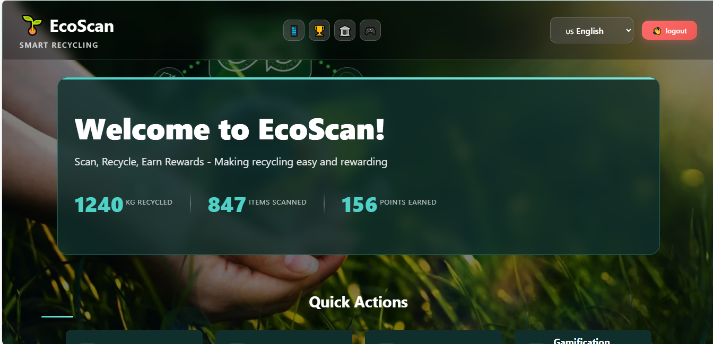
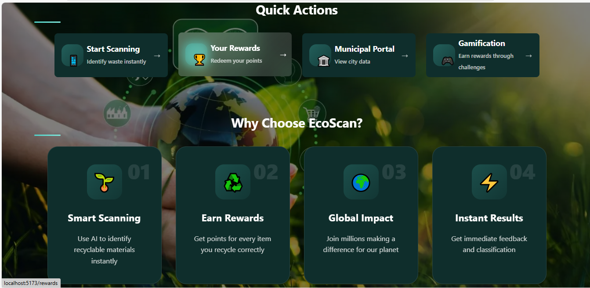
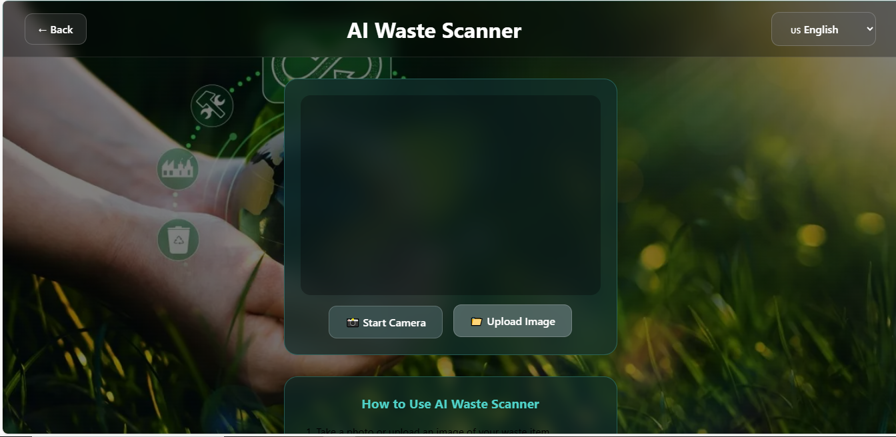
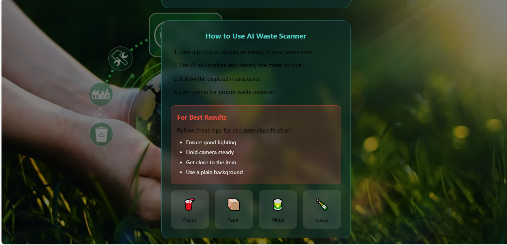
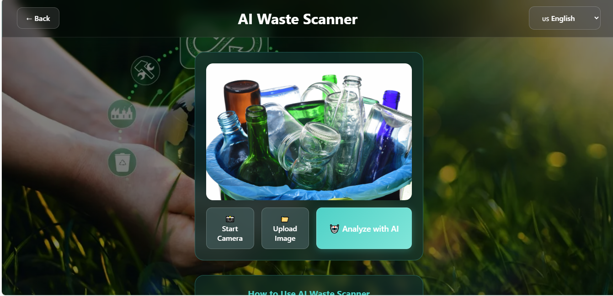
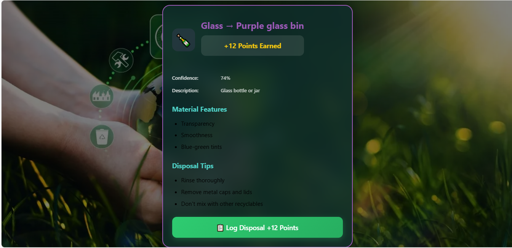
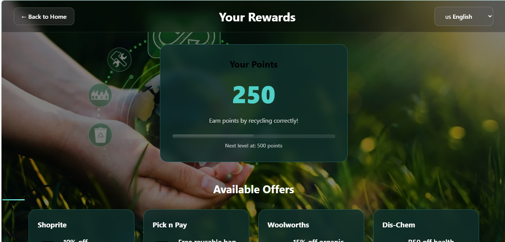
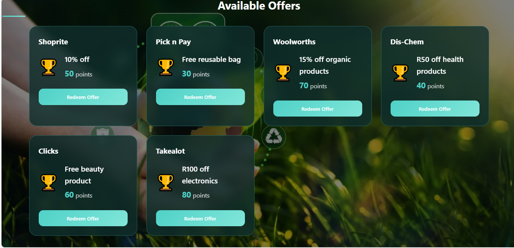
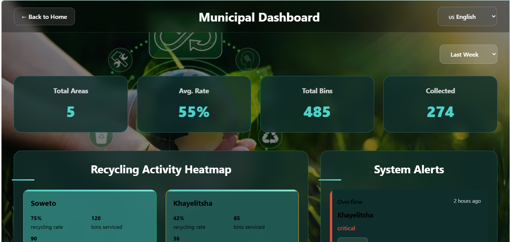

# 🌱 EcoScan - Smart Waste Management App



EcoScan is an innovative recycling application that leverages AI to help users properly classify and dispose of waste while earning rewards. The app features gamification elements, municipal dashboards, and multilingual support.

## ✨ Features

- **🧠 AI-Powered Waste Scanning**: Classify waste materials using Hugging Face's ML model
- **🏆 Reward System**: Earn points for recycling and redeem partner offers
- **🏛️ Municipal Dashboard**: Track recycling metrics and optimize collection routes
- **🎮 Gamification**: Complete challenges and climb the leaderboard
- **🌍 Multilingual Support**: Available in English, isiZulu, and Afrikaans
- **📊 Impact Tracking**: Visualize your environmental contribution
  
## 🌟 Features in Detail
### 🧠 Smart Waste Classification
- Real-time image analysis using Hugging Face model

- Detailed disposal instructions

- Material-specific recycling tips

- Confidence scoring for classifications

### 🏆 Reward System
- Earn points for each successful scan

- Redeem offers from eco-friendly partners

- Track redemption history

- Progress towards next reward tier

### 🏛️ Municipal Dashboard
- Heatmap of recycling activity

- Route optimization for waste collection

- Alert system for overflowing bins

- Time-based analytics (daily/weekly/monthly)

### 🎮 Gamification Elements
- Daily and weekly challenges

- Achievement system with rare unlocks

- Leaderboard with community rankings

- AI-generated personalized challenges

- Environmental impact visualization

### 🌍 Internationalization
The app supports three languages:

- English (🇺🇸)

- isiZulu (🇿🇦)

- Afrikaans (🇿🇦)

Language switching is available throughout the application.

## 📁 Project Structure
```
ecoscan/
├── public/ # Static assets
│ └── vite.svg
│
├── src/ # Source files
│ ├── assets/ # Images and media
│ │ ├── Home_Banner-4.jpg
│ │ ├── istockphoto.jpg
│ │ ├── react.svg
│ │ ├── Recycling-banner.webp
│ │ └── recycling.jpg
│ │
│ ├── components/ # React components
│ │ ├── App.jsx # Main application router
│ │ ├── Home.jsx # Dashboard view
│ │ ├── Login.jsx # Authentication
│ │ ├── Municipal.jsx # Municipal dashboard
│ │ ├── Rewards.jsx # Rewards system
│ │ ├── Scan.jsx # Waste scanning interface
│ │ └── SmartGamification.jsx # Gamification features
│ │
│ ├── styles/ # CSS files
│ │ ├── Auth.css
│ │ ├── Gamification.css
│ │ ├── Home.css
│ │ ├── Municipal.css
│ │ ├── Rewards.css
│ │ └── Scan.css
│ │
│ ├── i18n.js # Internationalization setup
│ ├── index.css # Global styles
│ └── main.jsx # Application entry point
│
├── package.json # Project dependencies
└── README.md # Project documentation
```
## 🚀 Getting Started

### Prerequisites
- Node.js (v16+ recommended)
- npm or yarn
- Vite development server

### Installation
1. Clone the repository:
   ```bash
   git clone https://github.com/calvinkhoza/EcoScan.git
   ```
   cd ecoscan
2. Install dependencies:

```bash
npm install
``` 
3. Set up environment variables:
Create a .env file in the root directory with your Hugging Face API token:
```
VITE_HF_API_TOKEN=your_huggingface_token_here
```
## 📱 Application Screens
### Home Dashboard


### Scanner Page




### Rewards Page


### Municipal Portal



